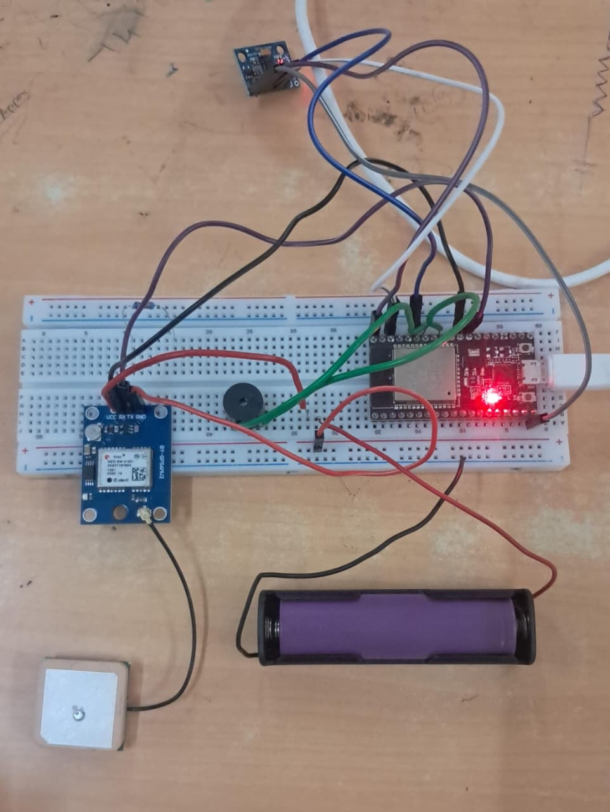
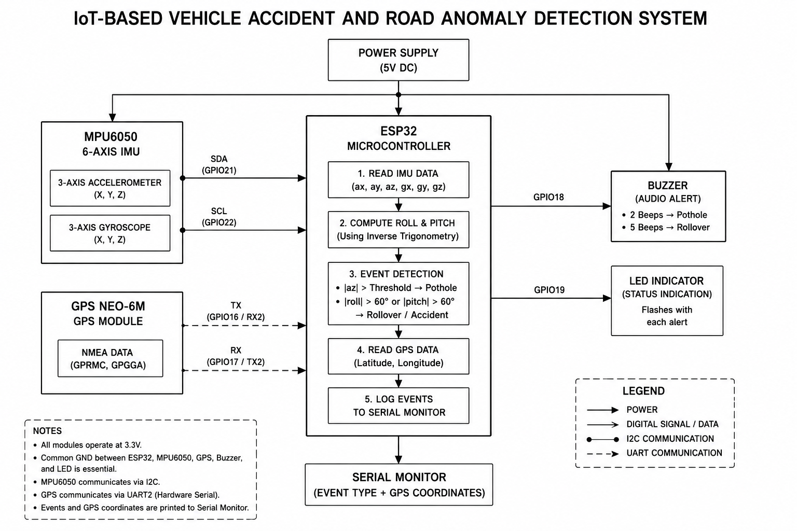
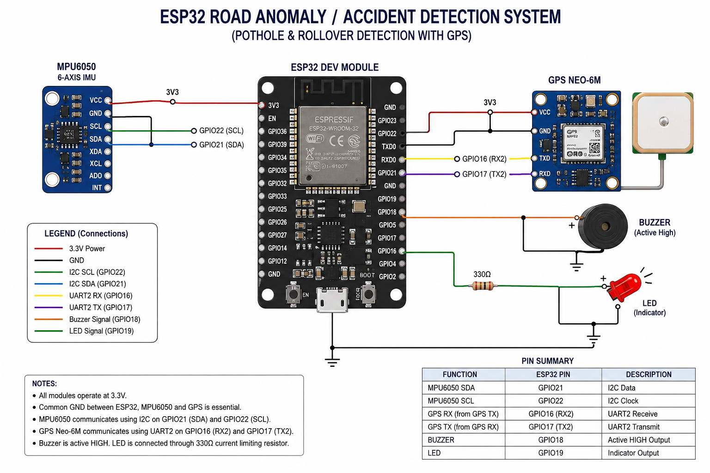

# ESP32 Pothole & Rollover Detection System

An ESP32-based road-anomaly detection prototype developed as a Measurement and Instrumentation mini-project.

The system uses an MPU6050 IMU to detect sudden impact and excessive vehicle tilt, while a Neo-6M GPS module is used for location acquisition. A buzzer provides an audible alert when an event is detected.

## Prototype

## System Design

### Block Diagram

### Wiring Diagram

## Components

The required components and their approximate costs are listed in [Components Requirement](components%20requirement.md).

## Detection

The prototype implements two detection conditions:

- **Pothole / Impact:** detected when the absolute Z-axis accelerometer reading exceeds the defined threshold.
- **Rollover:** detected when the absolute roll or pitch angle exceeds 60°.

## Test Output

The recorded Serial Monitor output is available in [test-output.txt](test-output.txt) and [test-output.png](https://github.com/oviyah17/esp32-pothole-and-rollover-detection/blob/main/Test%20Output.jpg)

## Prototype Demonstration

[Watch the prototype demonstration on YouTube](https://youtu.be/kc_G4s480Z4)

## Source Code

The complete ESP32 implementation is available in [code.ino](code.ino).

## Team

- Oviyashree
- Shiva Rithanya
- Vaishnavi
